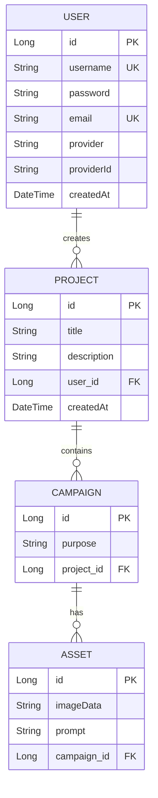

# BrandSnap Backend Documentation

## Table of Contents

1. [Introduction to Spring Boot](#introduction-to-spring-boot)
2. [Application Overview](#application-overview)
3. [Project Structure](#project-structure)
4. [Core Concepts](#core-concepts)
5. [Database Layer (Models & Repositories)](#database-layer)
6. [Business Logic Layer (Services)](#business-logic-layer)
7. [API Layer (Controllers)](#api-layer)
8. [Security Layer](#security-layer)
9. [Configuration](#configuration)
10. [Key Annotations Explained](#key-annotations-explained)
11. [How Data Flows](#how-data-flows)

---

## Introduction to Spring Boot

### What is Spring Boot?

**Spring Boot** is a Java framework that makes it easy to create stand-alone, production-ready applications. Think of it as a toolkit that provides:

- **Pre-configured components** - You don't have to set up everything from scratch
- **Embedded web server** - Your application can run without external servers
- **Dependency management** - Automatically handles compatible library versions
- **Convention over configuration** - Smart defaults so you write less boilerplate code

### Why Use Spring Boot?

```
Traditional Java Web App:
- Manual server setup (Tomcat, etc.)
- Complex XML configuration
- Manual dependency management
- Lots of boilerplate code

Spring Boot:
- Embedded server (just run the app!)
- Minimal configuration (application.properties)
- Automatic dependency resolution
- Focus on business logic
```

---

## Application Overview

**BrandSnap** is a marketing asset generator application that allows users to:

- Create and manage projects
- Organize campaigns within projects
- Generate AI-powered marketing assets using Google's Gemini API
- Authenticate via username/password or Google OAuth2

### Technology Stack

| Component               | Technology            | Purpose                        |
| ----------------------- | --------------------- | ------------------------------ |
| **Framework**           | Spring Boot 4.0.0     | Application foundation         |
| **Language**            | Java 25               | Programming language           |
| **Database**            | MySQL                 | Data persistence               |
| **ORM**                 | JPA/Hibernate         | Database interaction           |
| **Security**            | Spring Security + JWT | Authentication & authorization |
| **Build Tool**          | Maven                 | Dependency management          |
| **Code Simplification** | Lombok                | Reduce boilerplate code        |

---

## Project Structure

```
backend/
├── src/main/java/com/brandsnap/
│   ├── BrandSnapApplication.java          # Application entry point
│   ├── controller/                        # API endpoints (REST controllers)
│   │   ├── AuthController.java           # Login, register, OAuth
│   │   ├── ProjectController.java        # Project CRUD operations
│   │   ├── CampaignController.java       # Campaign CRUD operations
│   │   └── AssetController.java          # Asset generation & management
│   ├── model/                            # Database entities
│   │   ├── User.java                     # User entity
│   │   ├── Project.java                  # Project entity
│   │   ├── Campaign.java                 # Campaign entity
│   │   └── Asset.java                    # Asset entity
│   ├── repository/                       # Database access layer
│   │   ├── UserRepository.java
│   │   ├── ProjectRepository.java
│   │   ├── CampaignRepository.java
│   │   └── AssetRepository.java
│   ├── service/                          # Business logic layer
│   │   ├── UserService.java
│   │   ├── ProjectService.java
│   │   ├── CampaignService.java
│   │   └── AssetService.java
│   ├── security/                         # Security configuration
│   │   ├── SecurityConfig.java           # Main security setup
│   │   ├── JwtUtils.java                 # JWT token handling
│   │   ├── AuthTokenFilter.java          # Request authentication
│   │   ├── CustomUserDetailsService.java # User loading
│   │   └── OAuth2*.java                  # Google OAuth2 handlers
│   └── payload/                          # Request/Response DTOs
│       └── response/
│           └── JwtResponse.java
└── src/main/resources/
    └── application.properties            # Configuration file
```

### Layer Architecture

```
┌─────────────────────────────────────┐
│   Client (Frontend/Postman)        │
└─────────────────┬───────────────────┘
                  │ HTTP Requests
┌─────────────────▼───────────────────┐
│   CONTROLLER LAYER                  │  ← Handles HTTP requests
│   (AuthController, ProjectController)│
└─────────────────┬───────────────────┘
                  │ Calls methods
┌─────────────────▼───────────────────┐
│   SERVICE LAYER                     │  ← Business logic
│   (UserService, ProjectService)     │
└─────────────────┬───────────────────┘
                  │ Uses repositories
┌─────────────────▼───────────────────┐
│   REPOSITORY LAYER                  │  ← Database operations
│   (UserRepository, ProjectRepository)│
└─────────────────┬───────────────────┘
                  │ SQL queries
┌─────────────────▼───────────────────┐
│   DATABASE (MySQL)                  │
└─────────────────────────────────────┘
```

---

## Core Concepts

### 1. Dependency Injection (DI)

**What is it?** Instead of creating objects yourself, Spring creates and "injects" them for you.

**Without DI:**

```java
public class ProjectController {
    private ProjectService projectService = new ProjectService(); // Manual creation
}
```

**With DI (Spring Boot):**

```java
public class ProjectController {
    @Autowired  // Spring automatically creates and injects ProjectService
    private ProjectService projectService;
}
```

**Why is this good?**

- Loose coupling - Components don't depend on concrete implementations
- Easy testing - You can inject mock objects for testing
- Single responsibility - Spring manages object lifecycle

### 2. Inversion of Control (IoC)

Spring manages the lifecycle of your objects (called "beans"). You just declare what you need, and Spring handles creation, configuration, and destruction.

### 3. RESTful APIs

REST (Representational State Transfer) is a way to design web APIs using HTTP methods:

| HTTP Method | Purpose              | Example                                      |
| ----------- | -------------------- | -------------------------------------------- |
| **GET**     | Retrieve data        | `GET /api/projects` - Get all projects       |
| **POST**    | Create new data      | `POST /api/projects` - Create a project      |
| **PUT**     | Update existing data | `PUT /api/projects/1` - Update project #1    |
| **DELETE**  | Delete data          | `DELETE /api/projects/1` - Delete project #1 |

### 4. JPA (Java Persistence API)

JPA is a specification for managing relational data in Java. **Hibernate** is the implementation used by Spring Boot.

**What it does:**

- Maps Java objects to database tables
- Automatically generates SQL queries
- Manages relationships between entities

---

## Database Layer

### Models (Entities)

Models represent database tables. Each model class maps to a table, and each instance represents a row.

#### User Entity

```java
@Entity                              // Marks this as a database entity
@Data                                // Lombok: Auto-generates getters, setters, toString, etc.
@Table(name = "users")               // Maps to "users" table
public class User {

    @Id                              // Primary key
    @GeneratedValue(strategy = GenerationType.IDENTITY)  // Auto-increment
    private Long id;

    @Column(unique = true, nullable = false)  // Unique username, cannot be null
    private String username;

    @JsonProperty(access = JsonProperty.Access.WRITE_ONLY)  // Never send password in responses
    @Column(nullable = true)         // Nullable for OAuth2 users (no password)
    private String password;

    @Column(unique = true, nullable = false)
    private String email;

    @Enumerated(EnumType.STRING)     // Store enum as string in database
    @Column(nullable = false)
    private AuthProvider provider = AuthProvider.LOCAL;  // LOCAL or GOOGLE

    @Column(name = "provider_id")
    private String providerId;       // Google user ID for OAuth users

    private LocalDateTime createdAt;

    @PrePersist                      // Runs before saving to database
    protected void onCreate() {
        createdAt = LocalDateTime.now();
    }

    public enum AuthProvider {
        LOCAL,    // Username/password authentication
        GOOGLE    // Google OAuth2 authentication
    }
}
```

**Database Table Created:**

```sql
CREATE TABLE users (
    id BIGINT AUTO_INCREMENT PRIMARY KEY,
    username VARCHAR(255) UNIQUE NOT NULL,
    password VARCHAR(255),
    email VARCHAR(255) UNIQUE NOT NULL,
    provider VARCHAR(255) NOT NULL,
    provider_id VARCHAR(255),
    created_at DATETIME
);
```

#### Project Entity

```java
@Entity
@Data
@Table(name = "projects")
public class Project {
    @Id
    @GeneratedValue(strategy = GenerationType.IDENTITY)
    private Long id;

    @Column(nullable = false)
    private String title;

    private String description;

    @ManyToOne                       // Many projects belong to one user
    @JoinColumn(name = "user_id", nullable = false)  // Foreign key column
    private User createdBy;

    private LocalDateTime createdAt;

    @OneToMany(mappedBy = "project", cascade = CascadeType.ALL, orphanRemoval = true)
    @JsonIgnore                      // Don't include campaigns in JSON response (avoid circular reference)
    private List<Campaign> campaigns;

    @PrePersist
    protected void onCreate() {
        createdAt = LocalDateTime.now();
    }
}
```

**Relationship Explanation:**

- **@ManyToOne**: Many projects can belong to one user
- **@JoinColumn**: Creates a `user_id` column in the `projects` table
- **@OneToMany**: One project can have many campaigns
- **cascade = CascadeType.ALL**: When you delete a project, all its campaigns are deleted too
- **orphanRemoval = true**: If you remove a campaign from the list, it's deleted from database

#### Campaign Entity

```java
@Entity
@Data
@Table(name = "campaigns")
public class Campaign {
    @Id
    @GeneratedValue(strategy = GenerationType.IDENTITY)
    private Long id;

    @Column(nullable = false)
    private String purpose;          // Campaign description/purpose

    @ManyToOne
    @JoinColumn(name = "project_id", nullable = false)
    private Project project;         // Parent project

    @OneToMany(mappedBy = "campaign", cascade = CascadeType.ALL, orphanRemoval = true)
    @JsonIgnore
    private List<Asset> assets;      // Generated assets

    public int getAssetCount() {
        return assets != null ? assets.size() : 0;
    }
}
```

#### Asset Entity

```java
@Entity
@Data
@Table(name = "assets")
public class Asset {
    @Id
    @GeneratedValue(strategy = GenerationType.IDENTITY)
    private Long id;

    @Column(nullable = false, columnDefinition = "LONGTEXT")  // Large text for base64 images
    private String imageData;        // Base64 encoded image

    @Column(columnDefinition = "TEXT")
    private String prompt;           // AI prompt used to generate the image

    @ManyToOne
    @JoinColumn(name = "campaign_id", nullable = false)
    private Campaign campaign;       // Parent campaign
}
```

### Database Relationships Diagram



### Repositories

Repositories provide database access methods. Spring Data JPA automatically implements these interfaces!

```java
public interface UserRepository extends JpaRepository<User, Long> {
    // JpaRepository provides: save(), findById(), findAll(), delete(), etc.

    // Custom query methods - Spring generates SQL automatically!
    Optional<User> findByUsername(String username);
    Optional<User> findByEmail(String email);
    Boolean existsByUsername(String username);
    Boolean existsByEmail(String email);
}
```

**How it works:**

1. Spring reads the method name: `findByUsername`
2. Parses it: "find" + "By" + "Username"
3. Generates SQL: `SELECT * FROM users WHERE username = ?`

**Other examples:**

```java
// Find by email and provider
Optional<User> findByEmailAndProvider(String email, AuthProvider provider);
// Generated SQL: SELECT * FROM users WHERE email = ? AND provider = ?

// Find all projects by user
List<Project> findByCreatedBy(User user);
// Generated SQL: SELECT * FROM projects WHERE user_id = ?
```

---

## Business Logic Layer

Services contain the business logic of your application. They sit between controllers and repositories.

### UserService Example

```java
@Service                             // Marks this as a service component
public class UserService {

    @Autowired
    private UserRepository userRepository;

    @Autowired
    private PasswordEncoder passwordEncoder;  // For encrypting passwords

    /**
     * Register a new user with username and password
     */
    public User registerUser(User user) {
        // Validation: Check if username already exists
        if (userRepository.existsByUsername(user.getUsername())) {
            throw new RuntimeException("Username already exists");
        }

        // Validation: Check if email already exists
        if (userRepository.existsByEmail(user.getEmail())) {
            throw new RuntimeException("Email already exists");
        }

        // Encrypt password before saving (NEVER store plain text passwords!)
        user.setPassword(passwordEncoder.encode(user.getPassword()));

        // Set authentication provider
        user.setProvider(User.AuthProvider.LOCAL);

        // Save to database
        return userRepository.save(user);
    }

    /**
     * Find or create a Google OAuth2 user
     */
    public User findOrCreateGoogleUser(String email, String payload) {
        // Try to find existing user
        Optional<User> existingUser = userRepository.findByEmailAndProvider(
            email, User.AuthProvider.GOOGLE
        );

        if (existingUser.isPresent()) {
            return existingUser.get();  // User already exists
        }

        // Create new Google user
        User newUser = new User();
        newUser.setEmail(email);
        newUser.setUsername(email);     // Use email as username
        newUser.setProvider(User.AuthProvider.GOOGLE);
        newUser.setPassword(null);      // No password for OAuth users

        return userRepository.save(newUser);
    }

    public Optional<User> findByUsername(String username) {
        return userRepository.findByUsername(username);
    }
}
```

### ProjectService Example

```java
@Service
public class ProjectService {

    @Autowired
    private ProjectRepository projectRepository;

    @Autowired
    private UserRepository userRepository;

    /**
     * Create a new project for a user
     */
    public Project createProject(Project project, Long userId) {
        // Find the user who is creating the project
        User user = userRepository.findById(userId)
            .orElseThrow(() -> new RuntimeException("User not found"));

        // Set the creator
        project.setCreatedBy(user);

        // Save to database
        return projectRepository.save(project);
    }

    /**
     * Get all projects for a specific user
     */
    public List<Project> getProjectsByUser(Long userId) {
        User user = userRepository.findById(userId)
            .orElseThrow(() -> new RuntimeException("User not found"));

        return projectRepository.findByCreatedBy(user);
    }

    /**
     * Update a project
     */
    public Project updateProject(Long projectId, Project updatedProject) {
        // Find existing project
        Project project = projectRepository.findById(projectId)
            .orElseThrow(() -> new RuntimeException("Project not found"));

        // Update fields
        project.setTitle(updatedProject.getTitle());
        project.setDescription(updatedProject.getDescription());

        // Save changes
        return projectRepository.save(project);
    }

    /**
     * Delete a project (cascades to campaigns and assets)
     */
    public void deleteProject(Long projectId) {
        projectRepository.deleteById(projectId);
    }
}
```

### AssetService Example (AI Integration)

```java
@Service
public class AssetService {

    @Autowired
    private AssetRepository assetRepository;

    @Autowired
    private CampaignRepository campaignRepository;

    @Value("${nano.banana.api.key}")  // Reads from application.properties
    private String apiKey;

    private final RestTemplate restTemplate = new RestTemplate();

    /**
     * Generate a new asset using AI
     */
    public Asset generateAsset(Long campaignId, String prompt, String inputImage) {
        // Find the campaign
        Campaign campaign = campaignRepository.findById(campaignId)
            .orElseThrow(() -> new RuntimeException("Campaign not found"));

        // Call Google Gemini API to generate image
        String imageData = callNanoBananaApi(prompt, inputImage);

        // Create and save asset
        Asset asset = new Asset();
        asset.setCampaign(campaign);
        asset.setPrompt(prompt);
        asset.setImageData(imageData);  // Base64 encoded image

        return assetRepository.save(asset);
    }

    /**
     * Call Google Gemini API for image generation
     */
    private String callNanoBananaApi(String prompt, String inputImage) {
        try {
            String apiUrl = "https://generativelanguage.googleapis.com/v1beta/models/gemini-2.5-flash-image:generateContent";

            // Build request body (simplified)
            Map<String, Object> requestBody = buildRequestBody(prompt, inputImage);

            // Set headers
            HttpHeaders headers = new HttpHeaders();
            headers.setContentType(MediaType.APPLICATION_JSON);
            headers.set("x-goog-api-key", apiKey);

            HttpEntity<Map<String, Object>> request = new HttpEntity<>(requestBody, headers);

            // Make API call
            ResponseEntity<Map> response = restTemplate.postForEntity(apiUrl, request, Map.class);

            // Extract image from response
            if (response.getStatusCode().is2xxSuccessful() && response.getBody() != null) {
                return extractImageFromResponse(response.getBody());
            }

            // Return placeholder if API fails
            return getPlaceholderImage();

        } catch (Exception e) {
            System.err.println("Error calling Gemini API: " + e.getMessage());
            return getPlaceholderImage();
        }
    }
}
```

---

## API Layer

Controllers handle HTTP requests and return HTTP responses. They are the entry point for your API.

### AuthController Example

```java
@RestController                      // Marks this as a REST controller
@RequestMapping("/api/auth")         // Base path: all endpoints start with /api/auth
public class AuthController {

    @Autowired
    private UserService userService;

    @Autowired
    private AuthenticationManager authenticationManager;

    @Autowired
    private JwtUtils jwtUtils;

    /**
     * POST /api/auth/register
     * Register a new user
     */
    @PostMapping("/register")
    public ResponseEntity<?> register(@RequestBody User user) {
        try {
            User newUser = userService.registerUser(user);
            return ResponseEntity.ok(newUser);  // 200 OK with user data
        } catch (RuntimeException e) {
            return ResponseEntity.badRequest()  // 400 Bad Request
                .body(Map.of("message", e.getMessage()));
        }
    }

    /**
     * POST /api/auth/login
     * Login with username and password
     */
    @PostMapping("/login")
    public ResponseEntity<?> login(@RequestBody Map<String, String> credentials) {
        String username = credentials.get("username");
        String password = credentials.get("password");

        try {
            // Authenticate user
            Authentication authentication = authenticationManager.authenticate(
                new UsernamePasswordAuthenticationToken(username, password)
            );

            // Set authentication in security context
            SecurityContextHolder.getContext().setAuthentication(authentication);

            // Generate JWT token
            String jwt = jwtUtils.generateJwtToken(authentication);

            // Get user details
            UserDetails userDetails = (UserDetails) authentication.getPrincipal();
            User user = userService.findByUsername(username).orElseThrow();

            // Return JWT response
            return ResponseEntity.ok(new JwtResponse(
                jwt,
                user.getId(),
                userDetails.getUsername(),
                user.getEmail(),
                List.of("ROLE_USER")
            ));

        } catch (Exception e) {
            return ResponseEntity.status(401)   // 401 Unauthorized
                .body(Map.of("message", "Invalid credentials"));
        }
    }
}
```

### ProjectController Example

```java
@RestController
@RequestMapping("/api/projects")
public class ProjectController {

    @Autowired
    private ProjectService projectService;

    /**
     * GET /api/projects/user/{userId}
     * Get all projects for a user
     */
    @GetMapping("/user/{userId}")
    public ResponseEntity<List<Project>> getProjectsByUser(@PathVariable Long userId) {
        List<Project> projects = projectService.getProjectsByUser(userId);
        return ResponseEntity.ok(projects);
    }

    /**
     * POST /api/projects
     * Create a new project
     */
    @PostMapping
    public ResponseEntity<?> createProject(@RequestBody Map<String, Object> request) {
        try {
            Long userId = Long.valueOf(request.get("userId").toString());

            Project project = new Project();
            project.setTitle((String) request.get("title"));
            project.setDescription((String) request.get("description"));

            Project createdProject = projectService.createProject(project, userId);
            return ResponseEntity.ok(createdProject);

        } catch (Exception e) {
            return ResponseEntity.badRequest()
                .body(Map.of("message", e.getMessage()));
        }
    }

    /**
     * PUT /api/projects/{id}
     * Update a project
     */
    @PutMapping("/{id}")
    public ResponseEntity<?> updateProject(
        @PathVariable Long id,
        @RequestBody Project project
    ) {
        try {
            Project updated = projectService.updateProject(id, project);
            return ResponseEntity.ok(updated);
        } catch (Exception e) {
            return ResponseEntity.badRequest()
                .body(Map.of("message", e.getMessage()));
        }
    }

    /**
     * DELETE /api/projects/{id}
     * Delete a project
     */
    @DeleteMapping("/{id}")
    public ResponseEntity<?> deleteProject(@PathVariable Long id) {
        try {
            projectService.deleteProject(id);
            return ResponseEntity.ok(Map.of("message", "Project deleted"));
        } catch (Exception e) {
            return ResponseEntity.badRequest()
                .body(Map.of("message", e.getMessage()));
        }
    }
}
```

---

## Security Layer

Security is one of the most important aspects of any application. BrandSnap uses **JWT (JSON Web Tokens)** for stateless authentication.

### How JWT Authentication Works

```
1. User Login
   ┌──────────┐                    ┌──────────┐
   │  Client  │─── POST /login ───▶│  Server  │
   └──────────┘    (credentials)    └──────────┘
                                          │
                                          ▼
                                    Verify credentials
                                          │
                                          ▼
   ┌──────────┐                    ┌──────────┐
   │  Client  │◀── JWT Token ──────│  Server  │
   └──────────┘                    └──────────┘

2. Authenticated Requests
   ┌──────────┐                    ┌──────────┐
   │  Client  │─── GET /projects ─▶│  Server  │
   └──────────┘  Header: Bearer JWT └──────────┘
                                          │
                                          ▼
                                    Verify JWT
                                          │
                                          ▼
   ┌──────────┐                    ┌──────────┐
   │  Client  │◀── Project Data ───│  Server  │
   └──────────┘                    └──────────┘
```

### SecurityConfig

```java
@Configuration
@EnableWebSecurity
public class SecurityConfig {

    @Value("${app.frontend.url}")
    private String frontendUrl;

    @Autowired
    private CustomUserDetailsService userDetailsService;

    @Autowired
    private AuthEntryPointJwt unauthorizedHandler;

    @Bean
    public AuthTokenFilter authenticationJwtTokenFilter() {
        return new AuthTokenFilter();  // Filter that validates JWT on each request
    }

    @Bean
    public SecurityFilterChain securityFilterChain(HttpSecurity http) throws Exception {
        http
            // Enable CORS for frontend
            .cors(cors -> cors.configurationSource(corsConfigurationSource()))

            // Disable CSRF (not needed for stateless JWT)
            .csrf(csrf -> csrf.disable())

            // Handle authentication errors
            .exceptionHandling(exception ->
                exception.authenticationEntryPoint(unauthorizedHandler))

            // Stateless session (no server-side sessions)
            .sessionManagement(session ->
                session.sessionCreationPolicy(SessionCreationPolicy.STATELESS))

            // Authorization rules
            .authorizeHttpRequests(auth -> auth
                .requestMatchers("/api/auth/**", "/oauth2/**", "/login/oauth2/**")
                    .permitAll()           // Public endpoints
                .anyRequest()
                    .authenticated())      // All other endpoints require authentication

            // OAuth2 login configuration
            .oauth2Login(oauth2 -> oauth2
                .userInfoEndpoint(userInfo ->
                    userInfo.userService(customOAuth2UserService))
                .successHandler(oauth2AuthenticationSuccessHandler));

        // Add custom authentication provider
        http.authenticationProvider(authenticationProvider());

        // Add JWT filter before username/password authentication filter
        http.addFilterBefore(authenticationJwtTokenFilter(),
            UsernamePasswordAuthenticationFilter.class);

        return http.build();
    }

    @Bean
    public PasswordEncoder passwordEncoder() {
        return new BCryptPasswordEncoder();  // Encrypts passwords
    }
}
```

### JwtUtils - Token Generation and Validation

```java
@Component
public class JwtUtils {

    @Value("${brandsnap.app.jwtSecret}")
    private String jwtSecret;  // Secret key for signing tokens

    @Value("${brandsnap.app.jwtExpirationMs}")
    private int jwtExpirationMs;  // Token expiration time (24 hours)

    /**
     * Generate JWT token from authentication
     */
    public String generateJwtToken(Authentication authentication) {
        UserDetails userPrincipal = (UserDetails) authentication.getPrincipal();

        return Jwts.builder()
            .setSubject(userPrincipal.getUsername())  // Username in token
            .setIssuedAt(new Date())                  // Issue time
            .setExpiration(new Date(System.currentTimeMillis() + jwtExpirationMs))
            .signWith(SignatureAlgorithm.HS512, jwtSecret)  // Sign with secret
            .compact();
    }

    /**
     * Extract username from JWT token
     */
    public String getUserNameFromJwtToken(String token) {
        return Jwts.parser()
            .setSigningKey(jwtSecret)
            .parseClaimsJws(token)
            .getBody()
            .getSubject();
    }

    /**
     * Validate JWT token
     */
    public boolean validateJwtToken(String authToken) {
        try {
            Jwts.parser().setSigningKey(jwtSecret).parseClaimsJws(authToken);
            return true;
        } catch (SignatureException e) {
            System.err.println("Invalid JWT signature");
        } catch (MalformedJwtException e) {
            System.err.println("Invalid JWT token");
        } catch (ExpiredJwtException e) {
            System.err.println("JWT token is expired");
        } catch (UnsupportedJwtException e) {
            System.err.println("JWT token is unsupported");
        } catch (IllegalArgumentException e) {
            System.err.println("JWT claims string is empty");
        }
        return false;
    }
}
```

### AuthTokenFilter - Request Interceptor

```java
public class AuthTokenFilter extends OncePerRequestFilter {

    @Autowired
    private JwtUtils jwtUtils;

    @Autowired
    private CustomUserDetailsService userDetailsService;

    /**
     * This filter runs on EVERY request to validate JWT
     */
    @Override
    protected void doFilterInternal(
        HttpServletRequest request,
        HttpServletResponse response,
        FilterChain filterChain
    ) throws ServletException, IOException {

        try {
            // Extract JWT from request header
            String jwt = parseJwt(request);

            if (jwt != null && jwtUtils.validateJwtToken(jwt)) {
                // Get username from token
                String username = jwtUtils.getUserNameFromJwtToken(jwt);

                // Load user details
                UserDetails userDetails = userDetailsService.loadUserByUsername(username);

                // Create authentication object
                UsernamePasswordAuthenticationToken authentication =
                    new UsernamePasswordAuthenticationToken(
                        userDetails,
                        null,
                        userDetails.getAuthorities()
                    );

                // Set authentication in security context
                SecurityContextHolder.getContext().setAuthentication(authentication);
            }
        } catch (Exception e) {
            System.err.println("Cannot set user authentication: " + e.getMessage());
        }

        // Continue filter chain
        filterChain.doFilter(request, response);
    }

    /**
     * Extract JWT from Authorization header
     * Header format: "Bearer <token>"
     */
    private String parseJwt(HttpServletRequest request) {
        String headerAuth = request.getHeader("Authorization");

        if (headerAuth != null && headerAuth.startsWith("Bearer ")) {
            return headerAuth.substring(7);  // Remove "Bearer " prefix
        }

        return null;
    }
}
```

---

## Configuration

### application.properties

```properties
# Application name
spring.application.name=brandsnap

# Database Configuration
spring.datasource.url=${DB_URL:jdbc:mysql://localhost:3306/brandsnap?createDatabaseIfNotExist=true}
spring.datasource.username=${DB_USERNAME:root}
spring.datasource.password=${DB_PASSWORD:}
spring.datasource.driver-class-name=com.mysql.cj.jdbc.Driver

# JPA / Hibernate
spring.jpa.hibernate.ddl-auto=update  # Auto-create/update tables
spring.jpa.show-sql=${SHOW_SQL:false} # Show SQL queries in console
spring.jpa.properties.hibernate.dialect=org.hibernate.dialect.MySQLDialect

# Nano Banana API (Google Gemini)
nano.banana.api.key=${NANO_BANANA_API_KEY:}

# Frontend Configuration
app.frontend.url=${FRONTEND_URL:http://localhost:5173}

# JWT Configuration
brandsnap.app.jwtSecret=${JWT_SECRET:}
brandsnap.app.jwtExpirationMs=${JWT_EXPIRATION_MS:86400000}  # 24 hours

# Google OAuth2
spring.security.oauth2.client.registration.google.client-id=${GOOGLE_CLIENT_ID:}
spring.security.oauth2.client.registration.google.client-secret=${GOOGLE_CLIENT_SECRET:}
spring.security.oauth2.client.registration.google.scope=profile,email
spring.security.oauth2.client.registration.google.redirect-uri={baseUrl}/login/oauth2/code/{registrationId}
```

**Environment Variables:**

- `${VARIABLE_NAME:default_value}` - Uses environment variable or default value
- Set these in `.env` file or system environment variables

### pom.xml (Dependencies)

```xml
<dependencies>
    <!-- Spring Boot Web - REST API support -->
    <dependency>
        <groupId>org.springframework.boot</groupId>
        <artifactId>spring-boot-starter-web</artifactId>
    </dependency>

    <!-- Spring Boot Data JPA - Database access -->
    <dependency>
        <groupId>org.springframework.boot</groupId>
        <artifactId>spring-boot-starter-data-jpa</artifactId>
    </dependency>

    <!-- MySQL Driver -->
    <dependency>
        <groupId>com.mysql</groupId>
        <artifactId>mysql-connector-j</artifactId>
        <scope>runtime</scope>
    </dependency>

    <!-- Spring Security - Authentication & Authorization -->
    <dependency>
        <groupId>org.springframework.boot</groupId>
        <artifactId>spring-boot-starter-security</artifactId>
    </dependency>

    <!-- OAuth2 Client - Google Sign-In -->
    <dependency>
        <groupId>org.springframework.boot</groupId>
        <artifactId>spring-boot-starter-oauth2-client</artifactId>
    </dependency>

    <!-- JWT Dependencies -->
    <dependency>
        <groupId>io.jsonwebtoken</groupId>
        <artifactId>jjwt-api</artifactId>
        <version>0.11.5</version>
    </dependency>

    <!-- Lombok - Reduce boilerplate code -->
    <dependency>
        <groupId>org.projectlombok</groupId>
        <artifactId>lombok</artifactId>
        <version>1.18.40</version>
        <optional>true</optional>
    </dependency>

    <!-- Validation - Input validation -->
    <dependency>
        <groupId>org.springframework.boot</groupId>
        <artifactId>spring-boot-starter-validation</artifactId>
    </dependency>
</dependencies>
```

---

## Key Annotations Explained

### Class-Level Annotations

| Annotation               | Purpose                                                        | Example                              |
| ------------------------ | -------------------------------------------------------------- | ------------------------------------ |
| `@Entity`                | Marks a class as a database entity                             | `@Entity public class User {}`       |
| `@Table(name = "users")` | Specifies table name                                           | Maps to "users" table                |
| `@Data`                  | Lombok: Generates getters, setters, toString, equals, hashCode | Reduces boilerplate                  |
| `@Service`               | Marks a class as a service (business logic)                    | Spring manages it as a bean          |
| `@Repository`            | Marks an interface as a repository (data access)               | Enables exception translation        |
| `@RestController`        | Marks a class as a REST controller                             | Combines @Controller + @ResponseBody |
| `@Configuration`         | Marks a class as a configuration class                         | Contains @Bean methods               |
| `@Component`             | Generic Spring-managed component                               | For utility classes                  |

### Field-Level Annotations

| Annotation                           | Purpose                                    | Example                                               |
| ------------------------------------ | ------------------------------------------ | ----------------------------------------------------- |
| `@Id`                                | Marks field as primary key                 | `@Id private Long id;`                                |
| `@GeneratedValue`                    | Auto-generate value (e.g., auto-increment) | `@GeneratedValue(strategy = GenerationType.IDENTITY)` |
| `@Column`                            | Customize column properties                | `@Column(unique = true, nullable = false)`            |
| `@ManyToOne`                         | Many-to-one relationship                   | Many projects → one user                              |
| `@OneToMany`                         | One-to-many relationship                   | One project → many campaigns                          |
| `@JoinColumn`                        | Specifies foreign key column               | `@JoinColumn(name = "user_id")`                       |
| `@Autowired`                         | Inject dependency                          | Spring provides the instance                          |
| `@Value`                             | Inject property value                      | `@Value("${app.name}")`                               |
| `@JsonIgnore`                        | Exclude field from JSON                    | Prevents circular references                          |
| `@JsonProperty(access = WRITE_ONLY)` | Only accept in requests, never return      | For passwords                                         |

### Method-Level Annotations

| Annotation        | Purpose                        | Example                            |
| ----------------- | ------------------------------ | ---------------------------------- |
| `@GetMapping`     | Handle GET requests            | `@GetMapping("/projects")`         |
| `@PostMapping`    | Handle POST requests           | `@PostMapping("/projects")`        |
| `@PutMapping`     | Handle PUT requests            | `@PutMapping("/projects/{id}")`    |
| `@DeleteMapping`  | Handle DELETE requests         | `@DeleteMapping("/projects/{id}")` |
| `@RequestMapping` | Base path for all endpoints    | `@RequestMapping("/api/auth")`     |
| `@RequestBody`    | Extract request body as object | `@RequestBody User user`           |
| `@PathVariable`   | Extract URL path variable      | `@PathVariable Long id`            |
| `@RequestParam`   | Extract query parameter        | `@RequestParam String name`        |
| `@PrePersist`     | Run before saving to database  | Set createdAt timestamp            |
| `@Bean`           | Define a Spring-managed bean   | In @Configuration classes          |

---

## How Data Flows

### Example: Creating a Project

```
1. Client Request
   POST http://localhost:8080/api/projects
   Headers: Authorization: Bearer <JWT>
   Body: {
     "userId": 1,
     "title": "Summer Campaign",
     "description": "Q3 marketing materials"
   }

   ↓

2. AuthTokenFilter (Security Layer)
   - Extracts JWT from Authorization header
   - Validates token
   - Loads user details
   - Sets authentication in SecurityContext

   ↓

3. ProjectController (API Layer)
   @PostMapping
   public ResponseEntity<?> createProject(@RequestBody Map<String, Object> request) {
       Long userId = Long.valueOf(request.get("userId").toString());
       Project project = new Project();
       project.setTitle((String) request.get("title"));
       project.setDescription((String) request.get("description"));

       Project created = projectService.createProject(project, userId);
       return ResponseEntity.ok(created);
   }

   ↓

4. ProjectService (Business Logic Layer)
   public Project createProject(Project project, Long userId) {
       User user = userRepository.findById(userId)
           .orElseThrow(() -> new RuntimeException("User not found"));

       project.setCreatedBy(user);
       return projectRepository.save(project);
   }

   ↓

5. ProjectRepository (Data Access Layer)
   public interface ProjectRepository extends JpaRepository<Project, Long> {
       // save() method inherited from JpaRepository
   }

   ↓

6. Hibernate (ORM)
   Generates SQL:
   INSERT INTO projects (title, description, user_id, created_at)
   VALUES ('Summer Campaign', 'Q3 marketing materials', 1, '2024-12-08 10:00:00');

   ↓

7. MySQL Database
   Executes SQL and returns generated ID

   ↓

8. Response Flow (Reverse)
   Database → Hibernate → Repository → Service → Controller → Client

   Response:
   {
     "id": 5,
     "title": "Summer Campaign",
     "description": "Q3 marketing materials",
     "createdBy": {
       "id": 1,
       "username": "john_doe",
       "email": "john@example.com"
     },
     "createdAt": "2024-12-08T10:00:00"
   }
```

---

## Summary

### Key Takeaways

1. **Layered Architecture**

   - Controllers → Services → Repositories → Database
   - Each layer has a specific responsibility

2. **Dependency Injection**

   - Spring manages object creation and lifecycle
   - Use `@Autowired` to inject dependencies

3. **JPA/Hibernate**

   - Maps Java objects to database tables
   - Automatically generates SQL queries

4. **Spring Security + JWT**

   - Stateless authentication using tokens
   - Filter validates JWT on every request

5. **RESTful APIs**

   - Use HTTP methods (GET, POST, PUT, DELETE)
   - Return appropriate status codes

6. **Configuration**
   - `application.properties` for settings
   - Environment variables for sensitive data

---

## Quick Reference

### Common Commands

```bash
# Run the application
mvn spring-boot:run

# Build the application
mvn clean package

# Run tests
mvn test

# Clean build artifacts
mvn clean
```

### HTTP Status Codes

| Code | Meaning               | When to Use                        |
| ---- | --------------------- | ---------------------------------- |
| 200  | OK                    | Successful GET, PUT, DELETE        |
| 201  | Created               | Successful POST (resource created) |
| 400  | Bad Request           | Invalid input data                 |
| 401  | Unauthorized          | Missing or invalid authentication  |
| 403  | Forbidden             | Authenticated but not authorized   |
| 404  | Not Found             | Resource doesn't exist             |
| 500  | Internal Server Error | Server-side error                  |

### Useful Lombok Annotations

```java
@Data                    // Getters, setters, toString, equals, hashCode
@NoArgsConstructor       // No-argument constructor
@AllArgsConstructor      // Constructor with all fields
@Builder                 // Builder pattern
@Slf4j                   // Logger instance
```

---

**Happy Coding! 🚀**
