# Spring Boot Visual Learning Guide

## Table of Contents

1. [Architecture Diagrams](#architecture-diagrams)
2. [Request Flow Visualizations](#request-flow-visualizations)
3. [Database Relationships](#database-relationships)
4. [Security Flow](#security-flow)

---

## Architecture Diagrams

### Overall Application Architecture

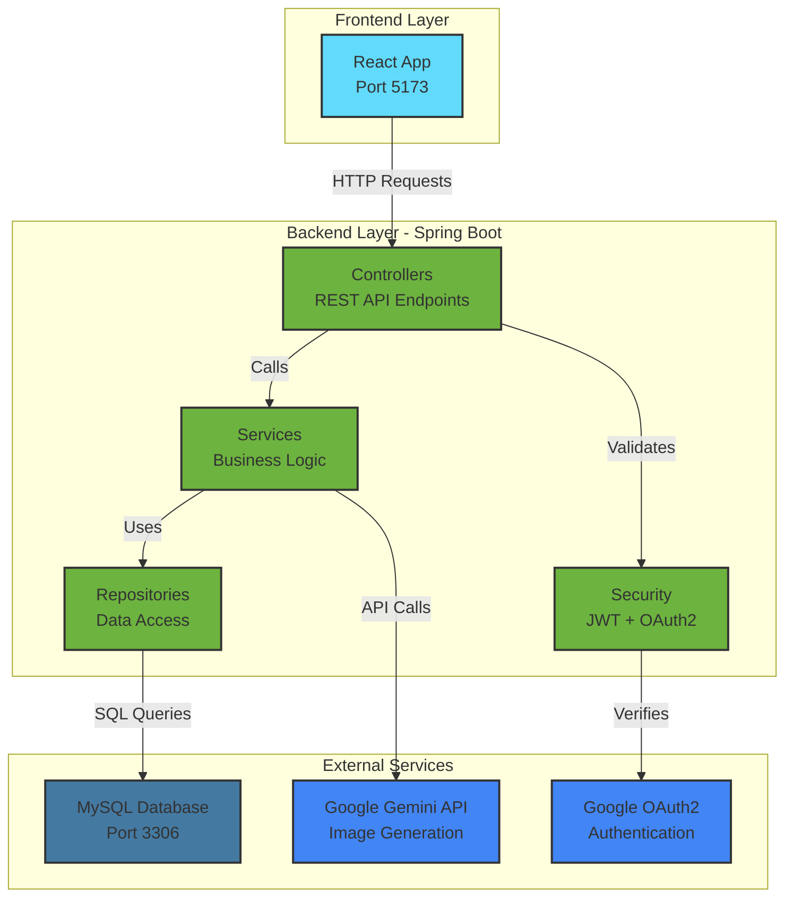

### Spring Boot Layered Architecture

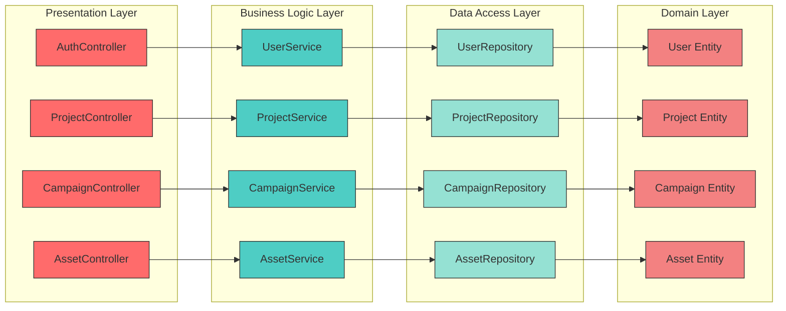

### Dependency Injection Flow

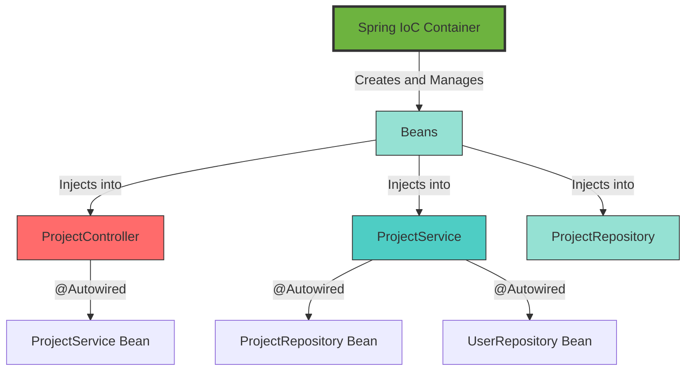

---

## Request Flow Visualizations

### User Registration Flow

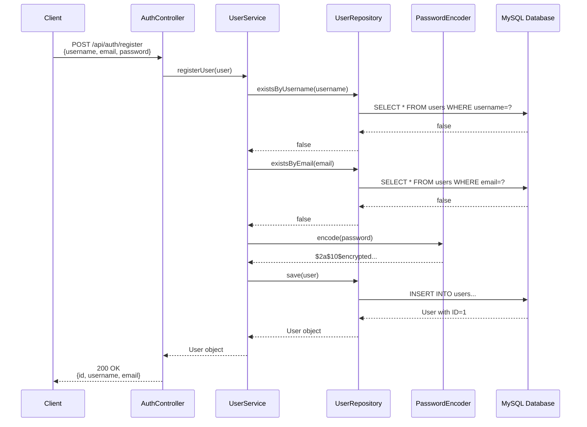

### Login & JWT Generation Flow

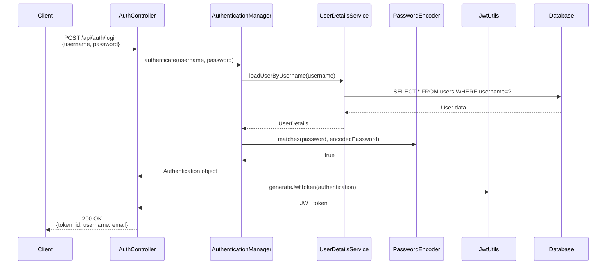

### Authenticated Request Flow

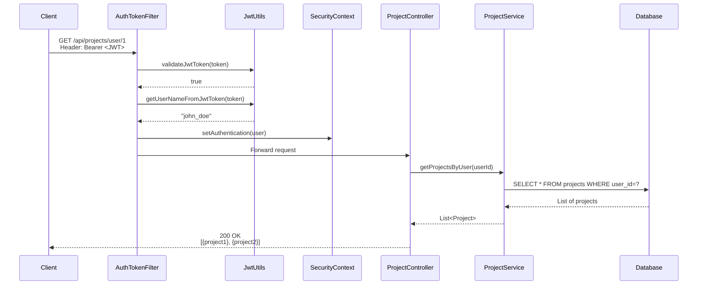

### Asset Generation Flow

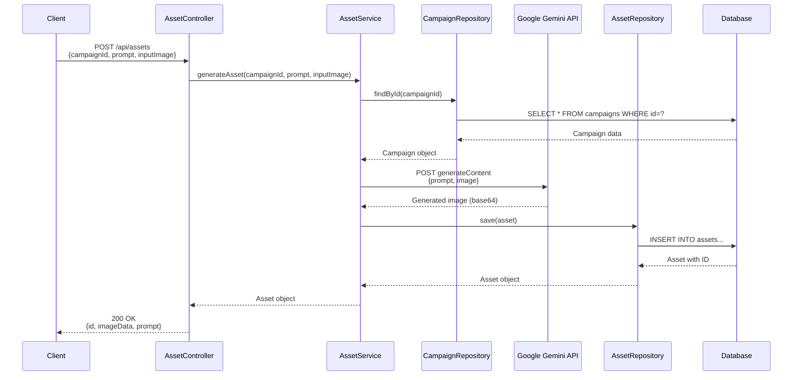

---

## Database Relationships

### Entity Relationship Diagram

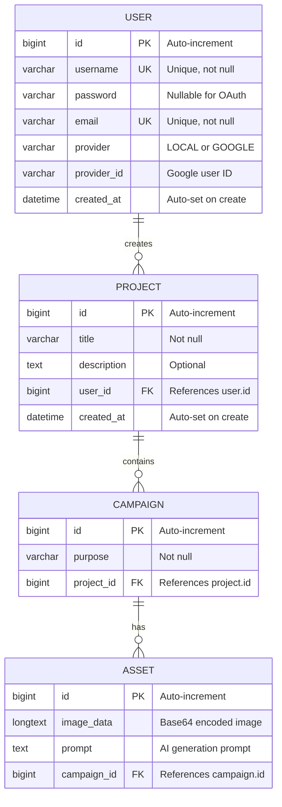

### Cascade Delete Behavior

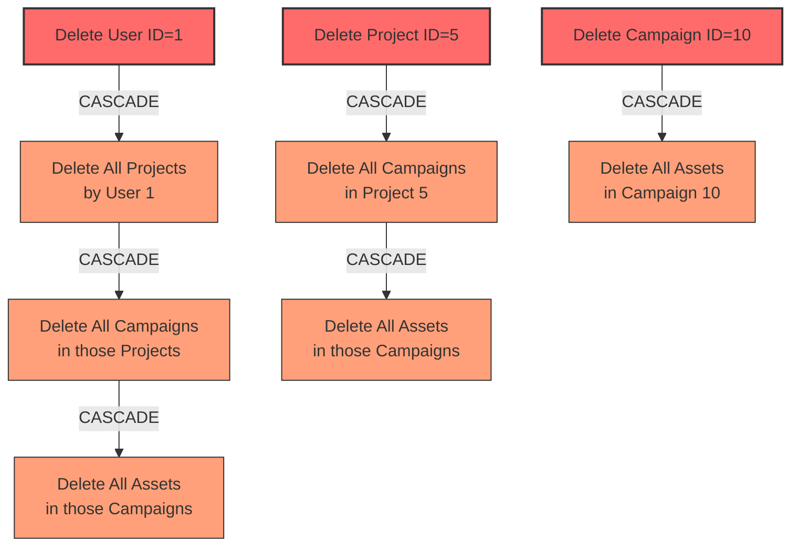

---

## Security Flow

### JWT Authentication Architecture

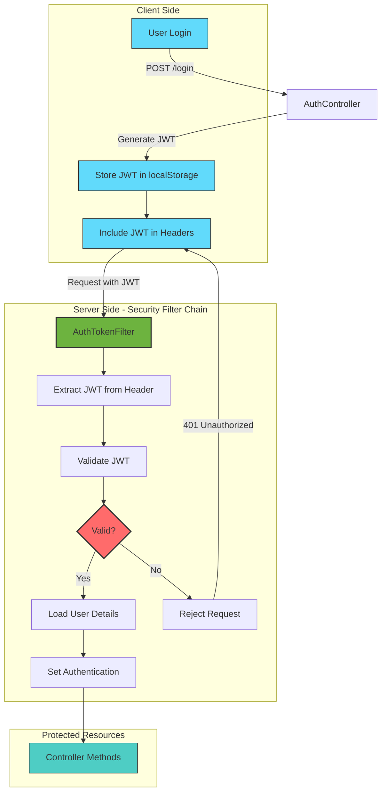

### OAuth2 Google Sign-In Flow

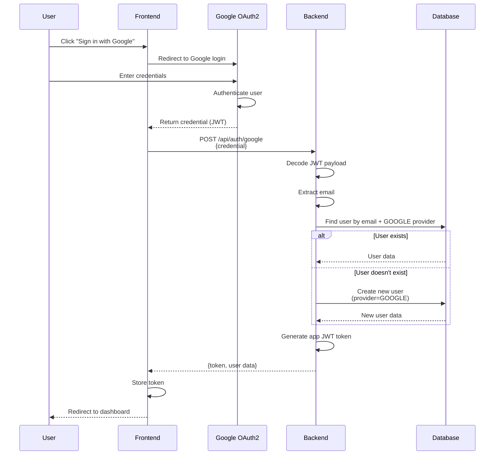

### Security Configuration Flow

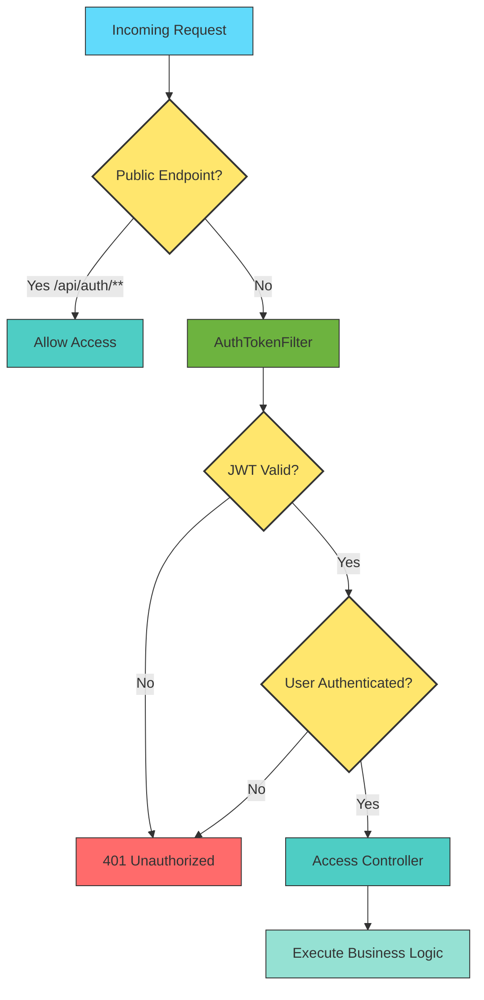

---
